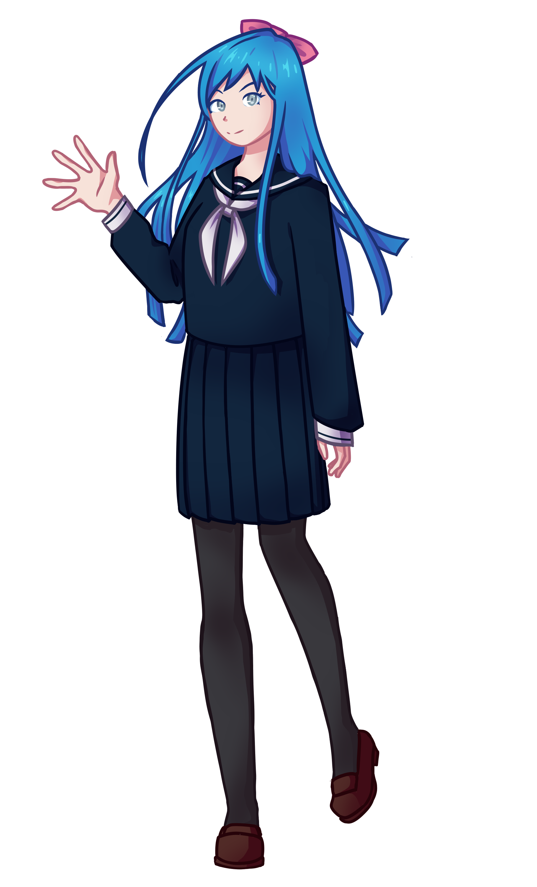

# Ani-chan

Ani-chan - A Discord bot for browsing AniList.

## Overview

Ani-chan is a bot for browsing AniList from within Discord.
You can search for anime and manga, compare server scores, and more.

### Using the bot

To use the bot, you can:

- [Invite it to your server](https://discord.com/api/oauth2/authorize?client_id=861173907644743680&permissions=137439308864&scope=bot)
- [Run it yourself](#running-the-bot)
- [Join the Dev Server](https://discord.gg/5s69DV7gwP) and use it there

### Features

- Searching for and displaying info about anime, mangas, and characters from AniList
- Link an AniList user and show their scores and statuses
- Compare scores of all the users in the server
- And [more in the future...](https://github.com/3174N/ani-chan/projects/1)

## Running the bot on your own

1. Clone the repository: `git clone https://github.com/3174N/ani-chan.git`
2. Create a `.token` file and put your bot token in it (see [.token.ex](.token.ex))
3. Create a `config.json` file (see [config.json.ex](config.json.ex))
4. Create an empty `users.json` file
5. Install dependencies: `pip install -r requirements.txt`
6. Run the bot: `python main.py`

_**NOTE:** If you plan to host the bot using a hosting service make sure it enables file saving. If it doesn't, use another service or change [files.py](files.py) however you see fit._

## License

The code in this repository is licensed under the [GPL-3 license](LICENSE), which basically allows you to do whatever you want with it.
Feel free to clone, fork, make changes to the code, etc'. PRs are welcome!

## Credits

- Hosted on [cronut.cafe](https://cronut.cafe/)
- [Annie May](https://github.com/AlexanderColen/Annie-May-Discord-Bot) for the idea
- [rerekinn](https://instagram.com/rerekinn?utm_medium=copy_link) for illustrating Ani-chan
